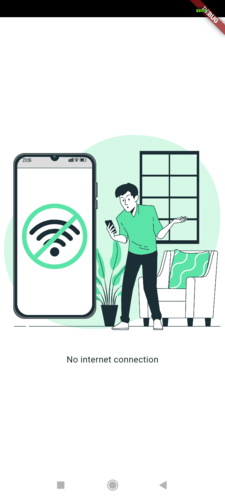

# net_aware
The **net_aware**, a network driven plugin manages internet connectivity in Flutter apps by wrapping the `MaterialApp` with  widget. 
It checks connectivity periodically, displaying the main app when online and a customizable offline widget when disconnected.
`child` is already wrapped in `SafeArea` widget.

## Features:
- Customizable intervals for checking connectivity with `checkInterval`.
- Customizable themes, routes, offline widgets, and images.
- Lightweight and dependency-free.

**net_aware** is ideal for apps requiring seamless offline handling and a consistent user experience.

## Installation
Add the following line to your pubspec.yaml file under `dependencies`:
```yaml
dependencies:
  net_aware: 1.0.4
```

## Usage
Basic Usage: <br>
Wrap your main widget or specific screens with NoInternetWidget:
```dart
import 'package:net_aware/net_aware.dart';

void main() {
  runApp(MyApp());
}

class MyApp extends StatelessWidget {
  @override
  Widget build(BuildContext context) {
    return NetAware(
      child: MyHomePage(),
    );
  }
}
```
You can also use a custom offline widget you want to show:
```dart
import 'package:flutter/material.dart';
import 'package:net_aware/net_aware.dart';

void main() {
  runApp(MyApp());
}

class MyApp extends StatelessWidget {
  @override
  Widget build(BuildContext context) {
    return NetAware(
      checkInterval: Duration(seconds: 5),
      imageAsset: 'assets/custom_no_internet.png',
      bgColor: Colors.grey[200],
      appBar: AppBar(
        title: Text("Offline Mode"),
      ),
      customWidget: Center(
        child: Column(
          mainAxisAlignment: MainAxisAlignment.center,
          children: [
            Icon(Icons.wifi_off, size: 80, color: Colors.red),
            SizedBox(height: 16),
            Text(
              "You are offline",
              style: TextStyle(fontSize: 18, fontWeight: FontWeight.bold),
            ),
          ],
        ),
      ),
      child: Scaffold(
        appBar: AppBar(title: Text('Home')),
        body: Center(child: Text('Welcome online!')),
      ),
    );
  }
}
```

## Additional Details
Parameters that can be used:
| Parameter                       | Type                                                    | Default Value                                | Description                                                                                    |
|---------------------------------|---------------------------------------------------------|----------------------------------------------|------------------------------------------------------------------------------------------------|
| `child`                         | `Widget`                                                | **Required**                                 | The main content widget to display when online.                                                |
| `checkInterval`                 | `Duration`                                              | `Duration(seconds: 3)`                       | Interval for checking internet connectivity.                                                   |
| `imageAsset`                    | `String?`                                               | `null`                                       | Custom image asset path for offline mode.                                                      |
| `bgColor`                       | `Color?`                                                | `Colors.white`                               | Background color for offline widget.                                                           |
| `appBar`                        | `AppBar?`                                               | `null`                                       | Custom AppBar for the offline widget.                                                          |
| `offlineWidget`                 | `Widget?`                                               | Default offline widget                       | Widget displayed when offline.                                                                 |
| `navigatorKey`                  | `GlobalKey<NavigatorState>?`                            | `null`                                       | A global key for the Navigator widget.                                                         |
| `scaffoldMessengerKey`          | `GlobalKey<ScaffoldMessengerState>?`                    | `null`                                       | A global key for the ScaffoldMessenger widget.                                                 |
| `home`                          | `Widget?`                                               | `null`                                       | The default route widget for the application.                                                  |
| `routes`                        | `Map<String, WidgetBuilder>`                            | `{}`                                         | Application route definitions.                                                                 |
| `initialRoute`                  | `String?`                                               | `null`                                       | The initial route to display.                                                                  |
| `onGenerateRoute`               | `RouteFactory?`                                         | `null`                                       | Callback for generating routes.                                                                |
| `onGenerateInitialRoutes`       | `InitialRouteListFactory?`                              | `null`                                       | Callback for generating initial routes.                                                        |
| `onUnknownRoute`                | `RouteFactory?`                                         | `null`                                       | Callback for unknown route handling.                                                           |
| `onNavigationNotification`      | `NotificationListenerCallback<NavigationNotification>?` | `null`                                       | Callback for navigation-related notifications.                                                 |
| `navigatorObservers`            | `List<NavigatorObserver>`                               | `[]`                                         | List of navigator observers.                                                                   |
| `builder`                       | `TransitionBuilder?`                                    | `null`                                       | A builder function for wrapping the app’s root widget.                                         |
| `title`                         | `String`                                                | `""`                                         | The application title.                                                                         |
| `onGenerateTitle`               | `GenerateAppTitle?`                                     | `null`                                       | Callback to generate the application title dynamically.                                        |
| `theme`                         | `ThemeData?`                                            | `null`                                       | Theme for the app.                                                                             |
| `darkTheme`                     | `ThemeData?`                                            | `null`                                       | Dark theme for the app.                                                                        |
| `highContrastTheme`             | `ThemeData?`                                            | `null`                                       | High-contrast theme for accessibility.                                                         |
| `highContrastDarkTheme`         | `ThemeData?`                                            | `null`                                       | High-contrast dark theme for accessibility.                                                    |
| `themeMode`                     | `ThemeMode?`                                            | `ThemeMode.system`                           | Theme mode for the app (light, dark, or system).                                               |
| `themeAnimationDuration`        | `Duration`                                              | `kThemeAnimationDuration` (200ms)            | Duration for theme transitions.                                                                |
| `themeAnimationCurve`           | `Curve`                                                 | `Curves.linear`                              | Animation curve for theme transitions.                                                         |
| `locale`                        | `Locale?`                                               | `null`                                       | Locale for the app.                                                                            |
| `localizationsDelegates`        | `Iterable<LocalizationsDelegate<dynamic>>?`             | `null`                                       | Localization delegates for the app.                                                            |
| `localeListResolutionCallback`  | `LocaleListResolutionCallback?`                         | `null`                                       | Callback to resolve the locale when multiple locales are supported.                            |
| `localeResolutionCallback`      | `LocaleResolutionCallback?`                             | `null`                                       | Callback to resolve the locale when only one locale is supported.                              |
| `supportedLocales`              | `Iterable<Locale>`                                      | `[Locale('en', 'US')]`                       | List of locales supported by the app.                                                          |
| `debugShowMaterialGrid`         | `bool`                                                  | `false`                                      | Whether to display a material grid overlay.                                                    |
| `showPerformanceOverlay`        | `bool`                                                  | `false`                                      | Whether to display the performance overlay.                                                    |
| `checkerboardRasterCacheImages` | `bool`                                                  | `false`                                      | Checkerboard raster cache images for debugging.                                                |
| `checkerboardOffscreenLayers`   | `bool`                                                  | `false`                                      | Checkerboard offscreen layers for debugging.                                                   |
| `showSemanticsDebugger`         | `bool`                                                  | `false`                                      | Whether to display a semantics debugger.                                                       |
| `debugShowCheckedModeBanner`    | `bool`                                                  | `true`                                       | Whether to display the debug banner.                                                           |
| `shortcuts`                     | `Map<ShortcutActivator, Intent>?`                       | `null`                                       | Custom shortcuts for the app.                                                                  |
| `actions`                       | `Map<Type, Action<Intent>>?`                            | `null`                                       | Custom actions for the app.                                                                    |
| `restorationScopeId`            | `String?`                                               | `null`                                       | Scope ID for state restoration.                                                                |
| `scrollBehavior`                | `ScrollBehavior?`                                       | `null`                                       | Custom scroll behavior for the app.                                                            |
| `themeAnimationStyle`           | `AnimationStyle?`                                       | `null`                                       | Style for theme animations.                                                                    |

Default screen when device will be offline: <br>


Developed by: <br>
Pranav Patel <br>
Personal email - pranav.patel2001@gmail.com <br>
Work email - pranavp@fermion.in <br>
LinkedIn - https://www.linkedin.com/in/pranav-patel-7b06a4188 <br>
Publisher's LinkedIn - https://www.linkedin.com/company/fermioninfotech?trk=profile-position
